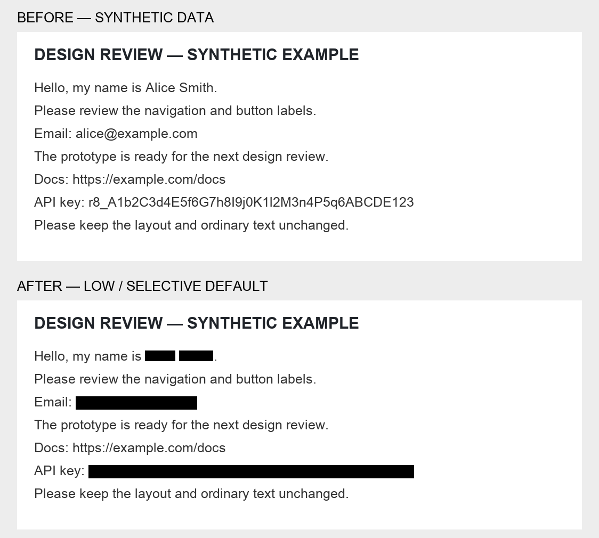

# Anonymizer

A local-first agent skill for selectively removing personal details and credentials from text and single-frame raster images. **Low is the default: preserve the document, hide only the personal bits.** Optional Replicate GPT Image 2.5 Sunburst cosmetic editing is consent-gated and never treated as proof of privacy.

## Location and use

The skill entry point is [SKILL.md](SKILL.md). In this checkout it lives at `~/Playground/skills/anonymizer`. It is not automatically registered in a separate agent profile. Ask an agent to load this file, or install the skill using your agent's normal skill installer.

```bash
cd ~/Playground/skills/anonymizer
uv venv .venv --python 3.12
uv pip install --python .venv/bin/python -r requirements.txt
brew install gitleaks tesseract  # macOS; use equivalent packages on other systems

# First run permits model-weight downloads, not remote input inference.
.venv/bin/python scripts/text_redact.py --input input.txt --output redacted.txt
# Subsequent runs can add --offline.

# Selective local OCR + Privacy Filter + Gitleaks (default).
.venv/bin/python scripts/image_redact.py --input input.png --output redacted.png --level low
# Broader contextual PII detection, still selective:
.venv/bin/python scripts/image_redact.py --input input.png --output medium.png --level medium
# Aggressive all-text OCR masking, explicitly opt in:
.venv/bin/python scripts/image_redact.py --input input.png --output high.png --level high

# Full blanket mask if no details should remain:
.venv/bin/python scripts/image_redact.py --input input.png --output covered.png --full-image

.venv/bin/python -m unittest discover -s tests -v
```

Commands refuse existing output files. Keep private inputs/output outside the repository. No reverse mapping is stored. The `.venv` and dependencies/model cache are not part of the skill distribution. Python 3.12 and Gitleaks 8.30.1 were used for verification.

## Before and after

Synthetic data only. The current example uses **low mode with automatic character-level PII mapping**: names, email and the API-key value are hidden; ordinary prose, labels, heading and public documentation URL remain. No manual boxes were needed for this synthetic example.



Actual text fixture input and local-model output are in [`examples/synthetic.txt`](examples/synthetic.txt) and [`examples/synthetic.redacted.txt`](examples/synthetic.redacted.txt).

## What is included

- `scripts/text_redact.py`: local OpenAI Privacy Filter inference, supplemental PII patterns, dedicated secret scanning, Unicode character-span merging, explicit-literal removal, safe separate output.
- `scripts/secret_scan.py`: pinned Gitleaks/RE2 credential rules plus conservative supplements. No key verification API calls or secret report files.
- `scripts/update_secret_rules.py`: explicit upstream rules refresh with revision/checksum provenance and preserved license.
- `scripts/image_redact.py` + `scripts/selective_ocr.py`: low/medium contextual PII mapping to hOCR character boxes, high all-text OCR, or manual boxes. Small-text OCR is upscaled 2× then mapped back to source pixels. Metadata stripping, EXIF orientation, alpha flattening, and multi-frame rejection remain unchanged.
- `scripts/replicate_finish.py`: optional reviewed-redacted-input upload to GPT Image 2.5 Sunburst, explicit consent flags, dry run, prediction resumption, immediate local download. Cosmetic results require another review/redaction pass.
- `tests/`: local regression suite. All fixtures are synthetic.
- `examples/`: synthetic text and screenshot before/after artifacts.

## Verification performed

- **48 tests passed**, including real cached-model inference (`ANONYMIZER_MODEL_TEST=1 .venv/bin/python -m unittest discover -s tests -v`). Coverage includes levels, complete BIOES spans, value-only credentials, label/path preservation, Unicode hOCR character alignment, masking pixels/metadata, real OCR, no-overwrite behavior and cloud consent gates. Without the environment flag the cached-model integration test is explicitly skipped.
- **Real local OpenAI model inference completed**. Model + patterns + Gitleaks removed the seeded name, address, email, phone, and password while retaining the picnic sentence. The first model-only test missed a natural-language password, which motivated a tested supplemental rule.
- The new synthetic demo was actually run and visually checked: low/medium produced 4 tight masks; high produced 44 word masks. Low retains the heading, ordinary sentences, labels and public docs link. Real dense-screenshot testing required five extra tight review boxes for missed display names/profile image after automatic masking; do not mistake this reviewed result for complete automatic detection.
- Q2 email test: low preserved the launch date and prose, removed names/email/phone, and also masked a project file ID that the model classified as `account_number`. This known semantic false positive is not hidden or fixed with a fixture-specific exception.
- Upstream Gitleaks config fetched and pinned: **221 regex rules**; see `references/gitleaks-provenance.json` for exact revision/checksum. Derived redaction rules omit entropy/allowlist suppression to favor recall.
- Replicate **dry-run and consent gates tested only**; no paid image generation performed. Live API schema documentation was checked. Do not label this as live cloud-generation verification.
- Repository skill frontmatter lint passed. This pack uses root README discovery and `.github/scripts/check-skills.py`; it has no manifest/resolver or GBrain conformance test to update.

## Limits

Not guaranteed anonymization or compliance certification. Regexes/model/OCR can miss secrets or personal details; combinations of retained facts can identify people. No automatic face/QR/plate detector. Selective image-text mapping exists but inherits OCR/model misses. Low versus medium changes categories/confidence, not mask opacity. No PDF, hidden-document-layer, or multi-frame processing. No recursive encoded-secret decoding. Images containing API keys need full-field review even after OCR. Never upload original private images by default. Rotate already-exposed credentials.

Sources and implementation lessons: [references/sources-and-limitations.md](references/sources-and-limitations.md).
